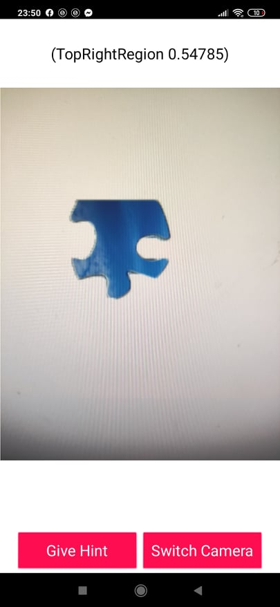

# 

# JigsawPuzzleAssistant

## Overview

This application targets whoever is interested in Jigsaw Puzzle as solving jigsaw puzzles reinforces the connections between brain cells and improve mental speed and is an increasingly operational and beneficial way to improve short-term memory, however, some people especially children often face difficulties while solving Jigsaw Puzzle which could bore them. This application assists the users in solving the puzzle by giving them hints about the region where the piece should be placed, the user simply opens the app, take a photo of the piece and asks for a hint, then the application hints the region without giving the exact position so there would still be a sense of competition, but remove the bore factor that would disappoint some users and results in never coming back to mind challenging  games. This application also helps kids who think they might be a bit slow or feeling any kind of inconvenience or inferiority to others, to make them eager to play such mind challenging games again.

This application leverages the power of Artificial Intelligence by using PersonalImageClassifier and Text to Speech in MIT App Inventor to create an app with a human-side.

## Screenshots

# 

## Datasets

The datasets used are either physically or digitally captured and then processed and are available each with their own `README.md` in the [Datasets][1] folder of this repo.

## Environment

This project was created by using and leveraging [MIT App Inventor][2] and [MIT App Inventor Extensions][3].

## Contributors

This project was initially created with love by [Ali Heikal][4] & [Abdelrahman Almowaled][5] of team Pharaohs from Egypt during [MIT App Inventor Hackathon 2020][6].

[1]: https://github.com/aliheikal/JigsawPuzzleAssistant/tree/master/Datasets
[2]: https://appinventor.mit.edu/
[3]: https://mit-cml.github.io/extensions/
[4]: https://www.linkedin.com/in/aliheikal/
[5]: https://www.linkedin.com/in/abdelrahman-elmowalid
[6]: https://hack2020.appinventor.mit.edu/
